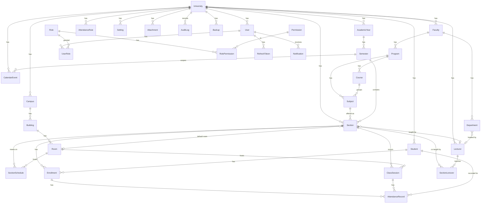

# Data Model — ClassWeb

> Source of truth: [`packages/database/prisma/schema.prisma`](../../packages/database/prisma/schema.prisma).
> This document explains the **why**. The schema is the **what**.

The Phase-1 schema is **32 tables / 19 enums / 58 foreign keys / 81 explicit indexes**, verified to apply against PostgreSQL 16 and to enforce its FK and composite-unique constraints.

---

## 1. Tenancy model

`University` is the **tenant root**. Every tenant-owned, directly-queried table
carries a denormalised `universityId`. This is the standard pattern for
PostgreSQL multi-tenancy: a single indexed predicate (`WHERE university_id = $tenant`)
scopes every query, and it is the anchor for Row-Level-Security policies added in
the security phase.

New Faculties, Programs, Campuses, Academic Years and Semesters are **rows, not
migrations** — satisfying "future tenants can be added without redesigning the
database."

```
University (tenant root)
├── Campus ── Building ── Room
├── Faculty ── Department
│            └── Program ── Course? ── Subject ── Section ── Enrollment ── Student
├── AcademicYear ── Semester ─────────────────────┘ (Section belongs to a Semester)
├── AttendanceRule / CalendarEvent / Setting / Attachment / Notification
├── User ── UserRole ── Role ── RolePermission ── Permission
└── AuditLog / Backup
```

## 2. Academic hierarchy & the Course/Subject decision

The spec lists **Course → Subject → Section** as three distinct levels. Real
curricula don't always use all three, so:

| Entity | Meaning | Required parent |
| --- | --- | --- |
| `Course` | Optional curriculum grouping ("Foundations of Nursing") | `Program` |
| `Subject` | The teachable catalogue unit — **Course Code, Description, Credits** | `Program` + `Course` (both **required**) |
| `Section` | A concrete offering in a `Semester` — teacher, room, schedule, capacity, enrolment | `Subject` + `Semester` |

`Subject.courseId` is **required**: the faculty confirmed that every subject
belongs to a curriculum Course, so the full three-level hierarchy
(Course → Subject → Section) is enforced at the database level.

## 3. Timetable: pattern vs. occurrence

Two tables, deliberately separated:

- **`SectionSchedule`** — the recurring *weekly pattern* (day, start, end, room).
  Renders the weekly/monthly timetable and is the input to **conflict detection**
  (room, teacher, section) via the `(roomId, dayOfWeek)` and
  `(lecturerId, dayOfWeek)` indexes.
- **`ClassSession`** — a *concrete dated occurrence* (generated from the pattern
  or created ad-hoc for make-ups). **Attendance attaches here**, never to the
  recurring pattern — so cancellations, holidays and make-ups are first-class.

## 4. Attendance rule engine

`AttendanceRule` is **scope-resolved, most-specific-wins**
(`SECTION > SEMESTER > PROGRAM > FACULTY > UNIVERSITY > SYSTEM` — the `ConfigScope`
enum). It carries every configurable value the spec demands: `lateAfterMinutes`
(15), `autoAbsentAfterMinutes` (60), `lockAfterMinutes`, `attendanceWeight`,
weekend/holiday inclusion, and the risk thresholds (80/70/60) that drive the
dashboard's at-risk analytics. `CalendarEvent` supplies the holiday / special-event
/ cancellation calendar the engine reads.

## 5. Cross-cutting design decisions

- **Soft delete** (`deletedAt`) on every major aggregate — records are never
  physically destroyed, preserving the audit trail (10-year retention).
- **`AuditLog`** captures user, action, entity, IP, user-agent and a JSON diff for
  every mutating/auth action.
- **`Setting`** is a scope-resolved JSON key/value store — one table backs logos,
  theme colour, PDF header/footer, email/SMTP config and backup schedule, so new
  settings need no migration.
- **`Attachment`** is a generic asset table (photos, signatures, logos, QR, reports)
  reused by every future module without schema change.
- **`metadata Json?`** escape hatch on core entities — additive, forward-compatible
  fields without a migration.
- **RBAC** is a true permission matrix: `Permission` (resource:action) ×
  `Role` × `User`, with optional per-grant scoping (`UserRole.scopeType/scopeId`).
  `RefreshToken` stores only a **hash**, never the token.

## 6. Extensibility for the ~30 future modules

The foundation was built so gradebook, quiz/exam, OSCE, clinical logbook,
portfolio, certificates, etc. attach via **new tables with stable FKs** to the
existing `Section`, `Enrollment`, `Student`, `Lecturer`, `Attachment` anchors —
**none of the Phase-1 tables need reshaping**. We deliberately did *not*
pre-create empty tables for future modules (that would be the placeholder work the
brief forbids); we created the *anchors and patterns* they will hang off.

---

## ER diagram


